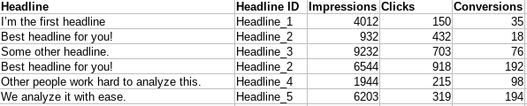

# n-gram Analysis for Marketing
A python based ngram analysis script which allows easy analysis of text data (adwords search terms, ad copy, etc).
This is done by splitting each text into it keywords and then aggregating each text's performance by it. If multiple
ads utilize a single keyword, we'll see it's combined performance, allowing us to discover which specific keywords 
(and their respective combinations) have the highest impact.

## Notes on how to interpret the analysis
It's important to note, that it aggregates everything by the ads performance. Insights from this analysis are not 
absolute (i.e. we can't say that if you throw in this specific keyword your ROI will jump by 100%). We can only say
that ads that utilized these specific keywords performed better than the rest of the ads, making this keyword and 
its context they conveyed a better suited alternative for your future ads. 

It's always worth to look at the generated insights as mere hypothesis for further testing, as ads performance
rely on the targeting.

This technique is especially useful for Google Ads' search terms, were we can easily see the context of search terms
and its respective performance, giving us an idea of what to add to the negative keywords list or new search terms.

# Getting Started
Install and run pipenv's shell in the root folder. Then just use one of these commands to start up the script.

`$ python ngram_analysis.py --file [FILE_NAME]` - relative path to the csv you want to analyze.  
`$ python ngram_analysis.py --folder [FOLDER_NAME]` - relative path to the folder containing csvs you want to analyze.

You can also utilize these flags for additional features:  
`--lemmatize` - for converting all words in the sentence to their base morphological form (i.e. "rocks" becomes "rock").

Please remember that the only requirement is to have your csv file/s formatted in a way that the first column contains
the text you want to have split and analyzed, while the other columns contain information about it's performance or some other
useful for you informations (like the ID of the ad, or other stuff).

Also please note two things: 
* that if you want to input something as a text (like an ID), you should add a prefix to the numbers so it won't
be treated as another numerical metric.
* with performance data, give only *non-calculated* metrics (that is no `Cost per Conversion`, or `CPC`) as the 
script only aggregates the numerical values by summing them up. Basically you'll end up with unusable metrics.

**Example**:  

## Prerequisites
* **Python version**: 3.5+ 
* **Package managers**: pipenv

## Instructions:
1. Please download the zip with the script (or git clone)
2. `pip install pipenv` - if it's not already installed
3. `pipenv shell` and later `pipenv install`.
4. `python -m spacy download en`
5. And now just run the script as described above in the [Getting Started](#getting-started) section.

# Authors:
* Robert Kuśka

# TODO:
* Add multi-processing for faster lemmatization parsing.
* Maybe some sort of automatic data download.
